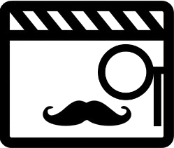
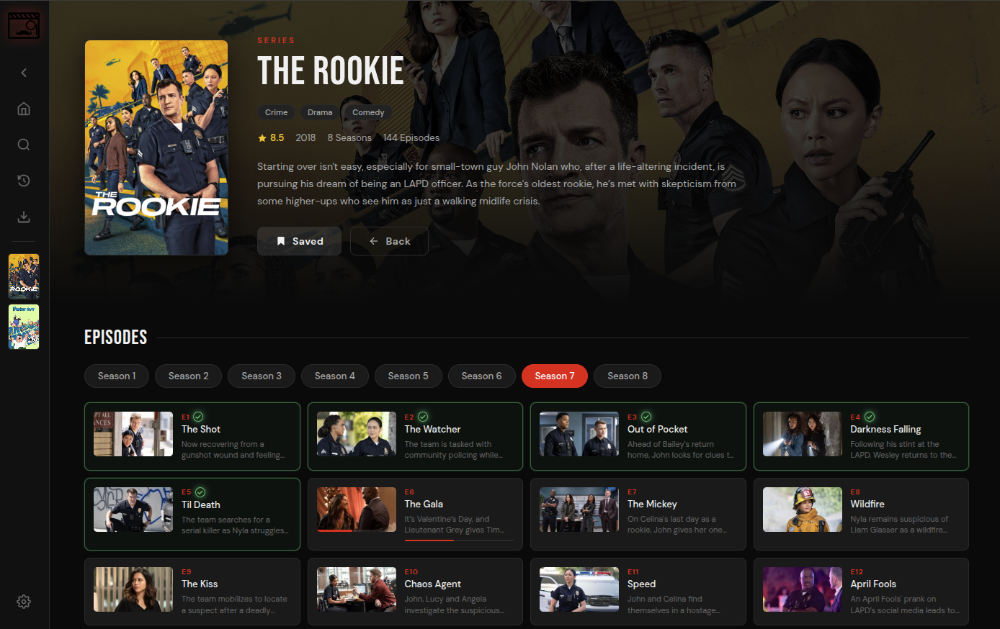

# Streambert




---

## Requirements

- [Node.js](https://nodejs.org/) (>=22.12.0) — download and install it first
- A free [TMDB API key](https://www.themoviedb.org/settings/api)

---

## Setup & Run

```bash
# 1. Open a terminal in the Code Folder, then install dependencies:
npm install

# 2. Start the dev server:
npm start

```

On first launch you'll be prompted to enter your TMDB API key. It's saved locally — you only need to do this once.

---

## Build for Production

```bash
npm run build
npm run preview
```

---

## Project Structure
```
Project Root
├── index.html
├── main.js
├── package.json
├── package-lock.json
├── preload.js
├── public
│   └── logo.svg
├── README.md
├── screenshots
│   ├── download.png
│   └── series.png
├── src
│   ├── App.jsx
│   ├── components
│   │   ├── DownloadModal.jsx
│   │   ├── Icons.jsx
│   │   ├── MediaCard.jsx
│   │   ├── SearchModal.jsx
│   │   ├── SetupScreen.jsx
│   │   └── Sidebar.jsx
│   ├── main.jsx
│   ├── pages
│   │   ├── DownloadsPage.jsx
│   │   ├── HomePage.jsx
│   │   ├── LibraryPage.jsx
│   │   ├── MoviePage.jsx
│   │   ├── SettingsPage.jsx
│   │   └── TVPage.jsx
│   ├── styles
│   │   └── global.css
│   └── utils
│       ├── api.js
│       └── storage.js
└── vite.config.js
```
