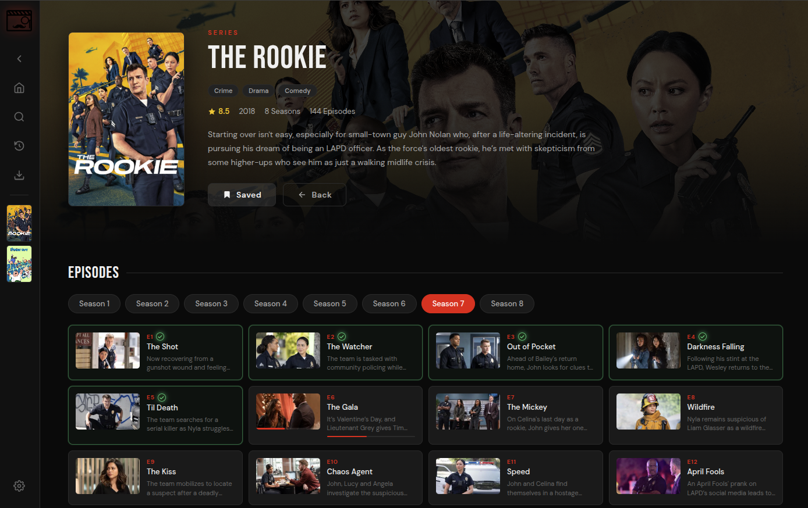
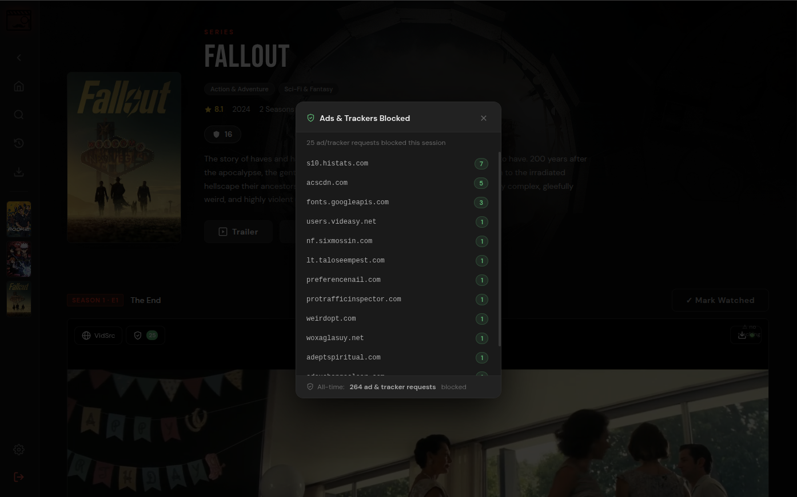
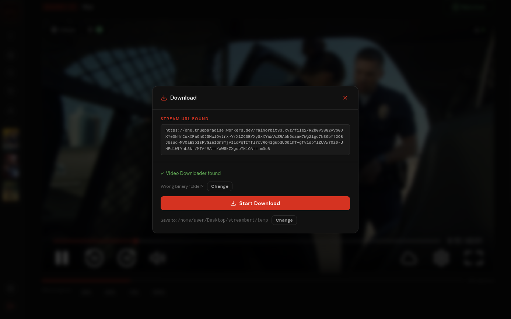

[](https://github.com/truelockmc/streambert/releases/latest/)
[](https://github.com/truelockmc/streambert/releases)
[](https://github.com/truelockmc/streambert/issues)
[](https://github.com/truelockmc/streambert/issues?q=is%3Aissue+is%3Aclosed)<br>

# Streambert
A cross-platform Electron Desktop App to stream and download any Movie, TV Series or Anime in the World. Zero Ads and Tracking <br></br>

[Installation](https://github.com/truelockmc/streambert?tab=readme-ov-file#installation)

## Why Streambert?
- 🎦 **Streaming:** Stream any Movie, Anime or TV Series from around the World.
- 📥 **Downloading:** Download anything you want to watch (with Subtitles).
- ⚙️ **Customizability:** Customize the Interface and Features to your unique needs.
- 📚 **Library:** Track what you watched, save stuff you want to watch and manage your Downloads.
- ✨ **Trending:** Discover new things to Watch every Day.
- 🛡️ **Privacy:** Completely Ads and Tracker free, forever.
- ⚡ **Speed:** Stream faster than any Browser can, download with multithreading.







---
[](https://github.com/truelockmc/streambert/stargazers)
---
## Streaming
The Application mainly gets Video Streams from videasy.net (you can also Stream from VidScr and 2Embed). <br></br>
It fetches Information for Images, Info Texts, Search and Homepage from [tmdb](https://www.themoviedb.org/).

---

## Downloading
You can download those Video Streams because the Program sources Links to their .m3u8 Playlist Files ([similar to this Browser Extension](https://addons.mozilla.org/en-US/firefox/addon/m3u8-link-finder/)). <br></br>
Once you click 'Download' these Links are used to download the Full Movie/TV Episode using [this Program](https://github.com/truelockmc/video-downloader). You can then watch them In-App or take the Files on any Storage Medium you want.

---

## Anime
You can also watch Anime, the App checks if a Movie or Series is an Anime and then sources its Metadata from [AniList](https://anilist.co/) instead of [tmdb](https://www.themoviedb.org/). <br></br>
Media Files for Animes are scraped from AllManga.to (i stole this mechanic from [ani-cli](https://github.com/pystardust/ani-cli)). The App directly gets .mp4 Files and doesnt evem show you the AllManga website, you can also download these Files, just like any other Content.


## Requirements

- [Node.js](https://nodejs.org/) (>=22.12.0) installed (only if you aren't using [prebuilt Binaries](https://github.com/truelockmc/streambert/releases/latest))
- A free [TMDB API Read Access Token](https://www.themoviedb.org/settings/api)
- For downloading, [this Program](https://github.com/truelockmc/video-downloader/releases/latest) somewhere on your PC and [ffmpeg](https://ffmpeg.org/download.html) installed

---
## Installation
On first launch you'll be prompted to enter your TMDB API key. It's saved locally, you only need to do this once.

### Linux, APT (recommended)

Add the repository once, then install and update via `apt`:
```bash
# Import GPG key
curl -fsSL https://truelockmc.github.io/streambert/KEY.gpg | sudo gpg --dearmor -o /etc/apt/keyrings/streambert.gpg

# Add repository
echo "deb [signed-by=/etc/apt/keyrings/streambert.gpg] https://truelockmc.github.io/streambert ./" | sudo tee /etc/apt/sources.list.d/streambert.list

# Install
sudo apt update && sudo apt install streambert
```

Future updates will be applied automatically with:
```bash
sudo apt update && sudo apt upgrade
```

### Linux, Manual (.deb / .AppImage)

Download the latest `.deb` or `.AppImage` from the [Releases](https://github.com/truelockmc/streambert/releases/latest) page.
```bash
# .deb
sudo dpkg -i streambert_*.deb

# .AppImage (you can also do it with Gearlever)
chmod +x Streambert-x64.AppImage && ./Streambert-x64.AppImage
```

### Windows

Download the latest `Streambert Setup *.exe` from the [Releases](https://github.com/truelockmc/streambert/releases/latest) page and run it.

---


## Building from Source
1. Install dependencies:
```bash
npm install
```
2. Build
```bash
npm run dist:win
```
or
```bash
npm run dist:linux
```

---
## Project Structure
```
Project Root
├── index.html
├── main.js
├── package.json
├── preload.js
├── vite.config.js
├── LICENSE
├── README.md
├── public
│   ├── icon.png
│   └── logo.svg
├── screenshots
│   ├── adblock.png
│   ├── anime.png
│   ├── download.png
│   ├── icon.png
│   ├── movie.png
│   ├── series.png
│   └── trending.png
└── src
    ├── App.jsx
    ├── main.jsx
    ├── components
    │   ├── BlockedStatsModal.jsx
    │   ├── CloseConfirmModal.jsx
    │   ├── DownloadModal.jsx
    │   ├── Icons.jsx
    │   ├── MediaCard.jsx
    │   ├── SearchModal.jsx
    │   ├── SetupScreen.jsx
    │   ├── Sidebar.jsx
    │   ├── TrailerModal.jsx
    │   └── TrendingCarousel.jsx
    ├── pages
    │   ├── DownloadsPage.jsx
    │   ├── HomePage.jsx
    │   ├── LibraryPage.jsx
    │   ├── MoviePage.jsx
    │   ├── SettingsPage.jsx
    │   └── TVPage.jsx
    ├── styles
    │   ├── global.css
    │   └── fonts
    │       ├── bebas-neue-regular.woff2
    │       ├── dm-sans-300.woff2
    │       ├── dm-sans-300italic.woff2
    │       ├── dm-sans-500.woff2
    │       ├── dm-sans-600.woff2
    │       └── dm-sans-regular.woff2
    └── utils
        ├── ageRating.js
        ├── api.js
        ├── storage.js
        ├── useBlockedStats.js
        └── useRatings.js
```
